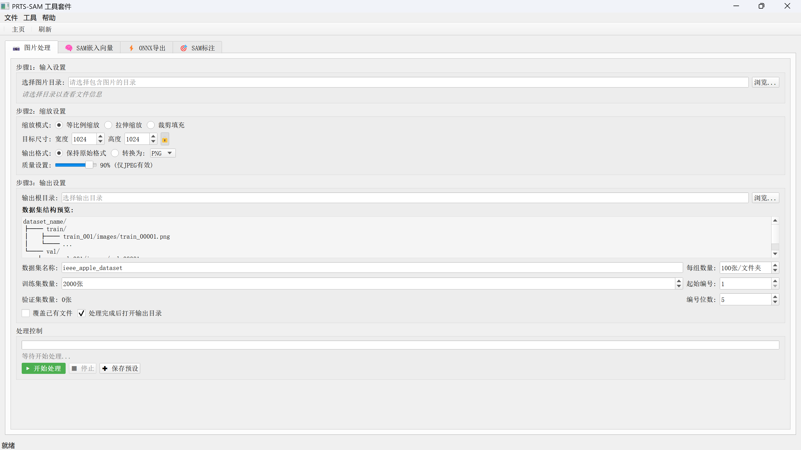
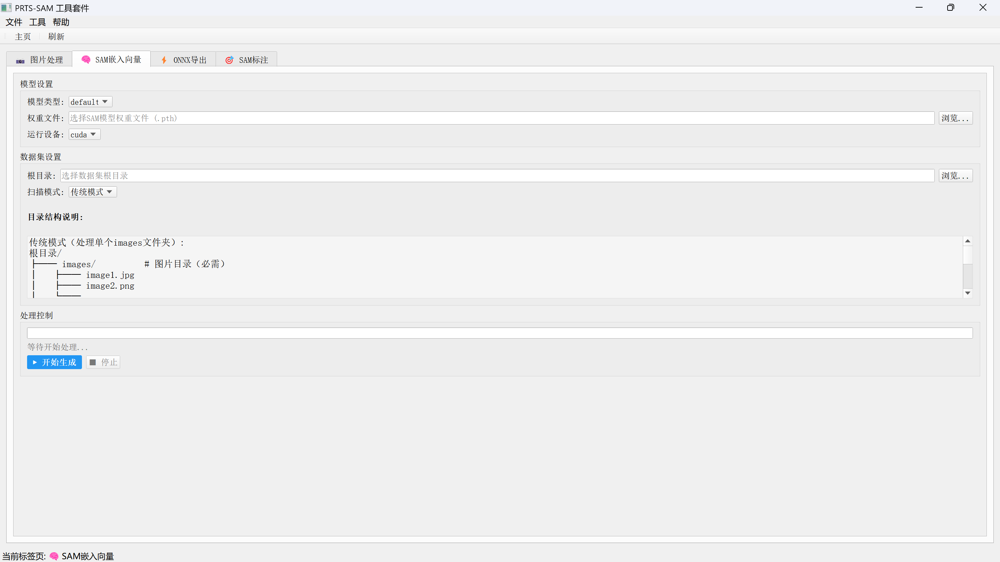
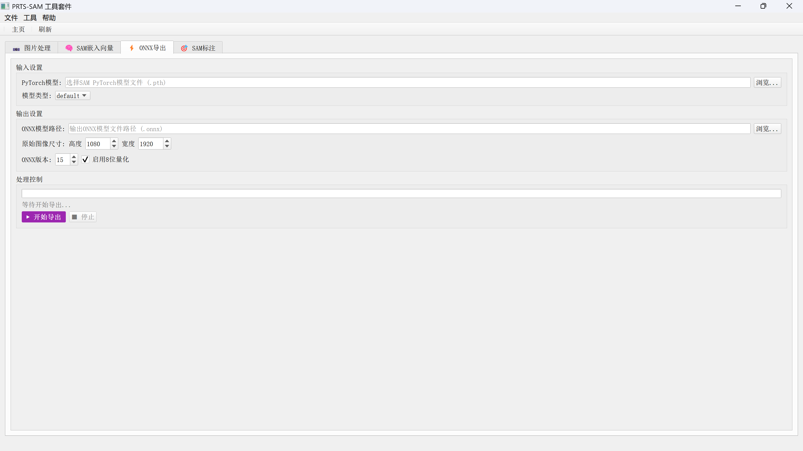
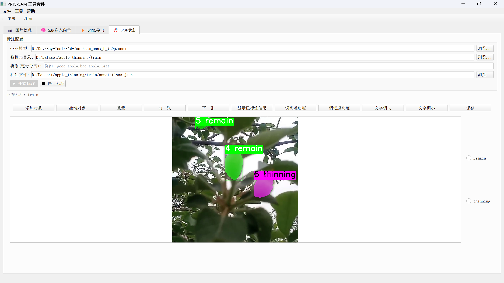

# PRTS-SAM (Point-click Region Tracking Software)

利用 Segment Anything (SAM) 模型进行快速标注的集成工具套件


## 🤔 这是什么？

这是一个基于 **Meta Segment Anything Model (SAM)** 的**一体化图像处理与标注工具套件**，集成了原SAM-Tool和segment-anything项目的核心功能，提供完整的GUI界面，无需命令行操作。

**核心特点**：一站式解决SAM相关任务，从数据预处理到模型部署，再到交互式标注

## ✨ 特性

- 📊 **数据预处理**：批量图片缩放、格式转换、数据集划分和分组存储
- 🧠 **嵌入向量预计算**：批量生成图像嵌入向量，加速后续标注
- ⚡ **ONNX 模型导出**：将 SAM 模型转换为 ONNX 格式，支持量化优化
- 🖱️ **交互式标注**：点几下鼠标，SAM 帮你找出目标，打上掩膜
- 🔧 **一体化界面**：所有功能集成在一个GUI中，无需切换工具
- 💾 **COCO 格式输出**：兼容 MMDetection、Detectron2 等主流框架

## 🏗️ 工具套件

### 📷 图片批量处理工具
- 支持等比例缩放、拉伸、裁剪三种模式
- 自动划分训练集和验证集
- 智能分组存储，避免单文件夹文件过多
- 统一重命名和编号

### 🧠 SAM 嵌入向量生成工具
- 支持传统模式和分组模式扫描
- 分组模式扫描时递归处理子文件夹中的 images 目录
- 实时进度显示和剩余时间预估
- 自动创建 embeddings 目录结构

### ⚡ ONNX 模型导出工具
- PyTorch 模型转换为 ONNX 格式
- 支持 8 位量化（减小模型大小）
- 动态形状支持（可变点数输入）
- 分阶段进度显示

### 🎯 SAM 标注工具
- 基于原SAM-Tool/salt的交互式标注功能
- 支持前景/背景点标注
- 实时掩码预测和调整
- 完整的快捷键支持

### 界面展示








## 🛠️ 安装

### 环境要求

- Python 3.8+
- PyTorch 1.12+ (推荐 1.12.1)
- 支持 CUDA 的显卡（可选，但推荐，一张RTX 3050 4G Laptop就行，问就是我的配置）

### 安装步骤

```bash
# 1.新建虚拟环境并安装pytorch
conda env create -f environment.yml -n myenv
conda activate myenv

2.安装segment_anything
mkdir your_ws
cd your_ws
git clone https://github.com/facebookresearch/segment-anything.git
cd segment-anything
pip install -e .

# 2. 克隆本项目
cd your_ws
git clone https://github.com/你的用户名/PRTS-SAM.git
cd PRTS-SAM

# 4. 下载 SAM 模型权重（选一个）
# vit_h 版本（2.4GB）
wget https://dl.fbaipublicfiles.com/segment_anything/sam_vit_h_4b8939.pth

# vit_l 版本（1.2GB）
wget https://dl.fbaipublicfiles.com/segment_anything/sam_vit_l_0b3195.pth

# vit_b 版本（375MB）
wget https://dl.fbaipublicfiles.com/segment_anything/sam_vit_b_01ec64.pth

# 将下载的权重文件放在 weights/ 目录下
```

## 🚀 使用方法

### 启动程序
```bash
python main.py
```

### 完整工作流程

#### 1. 数据准备（图片处理工具）
- 选择原始图片目录
- 设置缩放参数（模式、尺寸、格式）
- 配置输出结构（训练集/验证集划分、分组大小）
- 点击"开始处理"生成标准化数据集

#### 2. 嵌入向量预计算（嵌入向量工具）
- 选择数据集根目录
- 选择SAM模型权重和类型
- 选择扫描模式（传统模式或分组模式）
- 点击"开始生成"预计算所有图片的嵌入向量

#### 3. 模型导出（ONNX 导出工具）
- 选择PyTorch模型权重
- 设置输出路径和参数（图像尺寸、ONNX版本、是否量化）
- 点击"开始导出"生成ONNX推理模型

#### 4. 交互式标注（SAM 标注工具）
- 选择ONNX模型文件
- 选择数据集目录（包含images和embeddings）
- 输入类别标签（逗号分隔）
- 点击"开始标注"进入标注界面

### 标注快捷键

| 快捷键 | 功能 | 备注 |
|--------|------|------|
| 左键 | 添加前景点 | 绿色的点 |
| 右键 | 添加背景点 | 红色的点 |
| `A` / `←` | 上一张图片 | |
| `D` / `→` | 下一张图片 | |
| `R` | 重置当前点击点 | |
| `N` | 添加对象（确认掩码） | |
| `Ctrl+Z` | 撤销上一个对象 | |
| `Ctrl+S` | 保存所有标注 | |
| `K` | 调低透明度 | |
| `L` | 调高透明度 | |
| `Esc` | 退出标注界面 | |

## 📁 项目结构

```
PRTS-SAM/
├── main.py                 # 程序主入口
├── ui/                     # 用户界面
│   ├── main_window.py      # 主窗口
│   ├── image_resize.py     # 图片处理界面
│   ├── sam_embeddings.py   # 嵌入向量界面
│   ├── onnx_export.py      # ONNX导出界面
│   └── sam_annotator.py    # 标注界面
├── utils/                  # 工具模块
│   ├── image_resize/       # 图片处理核心
│   ├── sam_embeddings/     # 嵌入向量核心
│   ├── onnx_export/        # ONNX导出核心
│   └── sam_annotator/      # 标注核心（原salt模块）
├── assets/                 # 资源文件
├── dataset/                # 数据集目录（自动生成）
├── weights/                # 模型权重目录
├── requirements.txt        # 依赖列表
└── README.md               # 说明文档
```

## 📊 数据集结构示例

### 图片处理工具输出：
```
dataset/ieee_apple_dataset/
├── train/
│   ├── train_001/images/train_00001.png
│   ├── train_002/images/train_00101.png
│   └── ...
└── val/
    ├── val_001/images/val_02001.png
    └── ...
```

### 嵌入向量工具输出（分组模式）：
```
dataset/ieee_apple_dataset/
├── train/
│   ├── train_001/
│   │   ├── images/train_00001.png
│   │   └── embeddings/train_00001.npy
│   └── ...
└── val/
    ├── val_001/
    │   ├── images/val_02001.png
    │   └── embeddings/val_02001.npy
    └── ...
```

### 标注工具输出：
- `annotations.json`：COCO格式的标注文件

## ⚠️ 注意事项

1. **模型兼容性**：确保使用的SAM模型权重与模型类型匹配（vit_h、vit_l、vit_b）
2. **嵌入向量**：标注前需预计算嵌入向量，否则无法进行实时推理
3. **ONNX模型**：导出ONNX模型时需要指定原始图像尺寸，如果数据集图片尺寸不一，建议使用统一的预处理尺寸
4. **显存要求**：大模型（如vit_h）需要较多显存，如遇内存不足可尝试使用vit_b或vit_l模型
5. **备份标注**：标注过程中建议定期使用Ctrl+S保存，程序也会每10张图片自动保存一次


## 🤝 致谢

- [Meta Segment Anything](https://github.com/facebookresearch/segment-anything) - SAM模型基础
- [SAM-Tool](https://github.com/zhouayi/SAM-Tool) - 提供了交互式标注的GUI实现
- [salt](https://github.com/anuragxel/salt) - 标注工具的核心逻辑
- [PyQt5](https://www.riverbankcomputing.com/software/pyqt/) - GUI框架

## 📄 License

MIT License
这个项目是为我自己的毕设开发的小工具，可能不怎么会更新

---

**如果这个工具帮到了你，给个 Star ⭐ 呗**

> **最后更新**：2026年1月6日
> 
> **当前版本**：v1.0.0
> 
> **核心功能**：图片处理 ✓ | 嵌入向量 ✓ | ONNX导出 ✓ | SAM标注 ✓